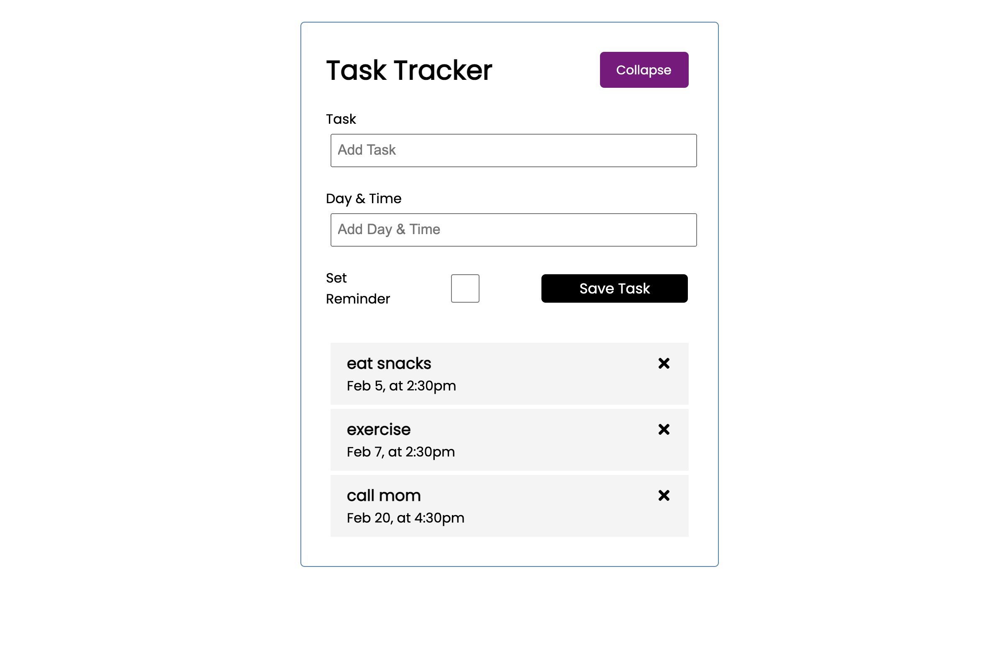

# Getting Started with Create React App

This project was bootstrapped with [Create React App](https://github.com/facebook/create-react-app).

## Available Scripts

In the project directory, you can run:

### What i've learned so far
 5/12/21 - React is a front-end library that runs in the browser. It's used to create single page applications. React also makes really fast interactive interfaces.
Runs the app in the development mode.

5/12/ 21 - Creating a to-do list using React is really fun! I imported Button from './Button' so that it would actually be rendered on the page. Otherwise, I get an error.

5/12/21 - There are multiple ways to imbed styling. It can be done inline, and it can also be done by declaring const headingStyle property.

5/13/21 - I learned how to remove tasks from the to-do list using React. I also learned that  '&&' is a shorter way of using a ternary expression for conditionals

React also makes it so that you can create dynamic interfaces without having to reload the page (on the second click, 'Collapse' changes to 'Add' and this is accomplished by embedded JavaScript and a conditional)

I was able to learn how to build for production by installing the -g server and deploying the build folder. This static server becomes the deployed version, I think. 

Open [http://localhost:3000](http://localhost:3000) to view it in the browser.

The page will reload if you make edits.
You will also see any lint errors in the console.

### `npm test`
